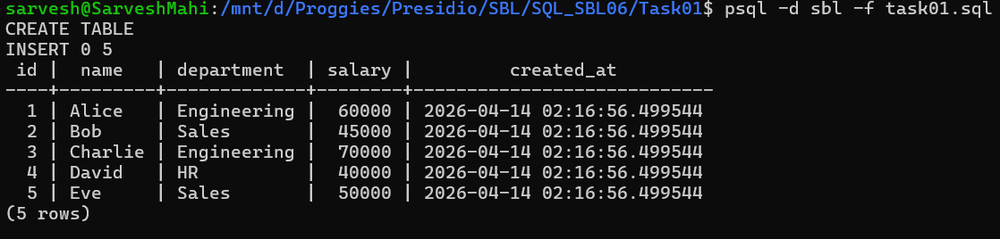

# 📘 SQL Task 1: Creating and Populating Tables

## 🎯 Objective

The goal of this task is to:

* Create a database table using SQL
* Insert multiple records into the table
* Retrieve and verify the inserted data using basic queries

---

## 🛠️ Environment

* **Database:** PostgreSQL
* **Execution Method:** WSL (Linux terminal using `psql`)
* **Database Name:** `sbl`

---

## 🧱 Step 1: Table Creation

A table named `employees` was created with appropriate data types and constraints.

### ✅ Query Used

```sql
CREATE TABLE employees (
    id SERIAL PRIMARY KEY,
    name VARCHAR(100) NOT NULL,
    department VARCHAR(50),
    salary INT CHECK (salary > 0),
    created_at TIMESTAMP DEFAULT CURRENT_TIMESTAMP
);
```

### 💡 Explanation

* `id`: Auto-incremented unique identifier
* `name`: Employee name (cannot be NULL)
* `department`: Department of the employee
* `salary`: Must be greater than 0 (validated using CHECK constraint)
* `created_at`: Automatically stores record creation time

---

## 📥 Step 2: Inserting Data

Multiple rows were inserted into the table in a single query.

### ✅ Query Used

```sql
INSERT INTO employees (name, department, salary) VALUES
('Alice', 'Engineering', 60000),
('Bob', 'Sales', 45000),
('Charlie', 'Engineering', 70000),
('David', 'HR', 40000),
('Eve', 'Sales', 50000);
```

### 💡 Explanation

* Demonstrates efficient multi-row insertion
* Simulates realistic employee data

---

## 📤 Step 3: Retrieving Data

The inserted data was verified using a SELECT query.

### ✅ Query Used

```sql
SELECT * FROM employees;
```

---

## 📊 Output



---

## ✅ Conclusion

* Successfully created a table with constraints
* Inserted multiple records efficiently
* Verified data using a SELECT query

This task demonstrates foundational SQL operations required for database design and data manipulation.

---

## 🚀 Key Learnings

* Importance of constraints (`PRIMARY KEY`, `NOT NULL`, `CHECK`)
* Efficient data insertion using multi-row `INSERT`
* Basic data retrieval using `SELECT`
* Working with PostgreSQL in a terminal environment (WSL)

---
