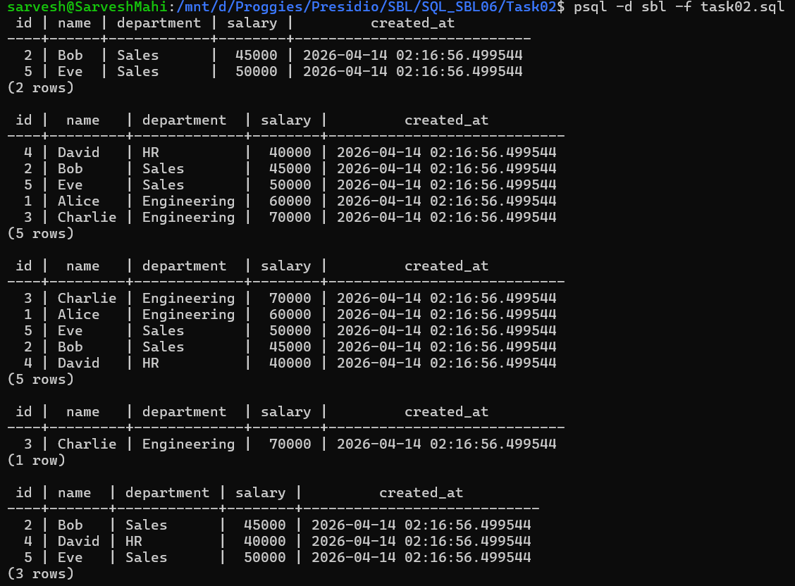
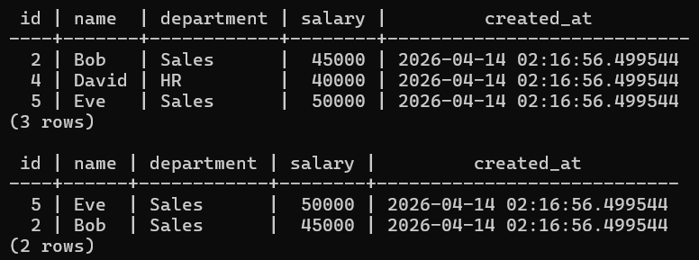

# 📘 SQL Task 2: Basic Filtering and Sorting

## 🎯 Objective

The goal of this task is to:

* Filter records using conditions
* Sort query results in a meaningful order
* Apply multiple conditions using logical operators (`AND`, `OR`)

---

## 🛠️ Environment

* **Database:** PostgreSQL
* **Execution Method:** WSL (Linux terminal using `psql`)
* **Database Name:** `sbl`
* **Table Used:** `employees`

---

## 🔍 Step 1: Filtering using WHERE

### ✅ Query Used

```sql
SELECT * FROM employees
WHERE department = 'Sales';
```

### 💡 Explanation

* Retrieves only employees who belong to the **Sales** department.

---

## 🔽 Step 2: Sorting using ORDER BY (Ascending)

### ✅ Query Used

```sql
SELECT * FROM employees
ORDER BY salary ASC;
```

### 💡 Explanation

* Sorts all employees by salary in **ascending order** (lowest to highest).

---

## 🔼 Step 3: Sorting using ORDER BY (Descending)

### ✅ Query Used

```sql
SELECT * FROM employees
ORDER BY salary DESC;
```

### 💡 Explanation

* Sorts all employees by salary in **descending order** (highest to lowest).

---

## 🔗 Step 4: Multiple Conditions using AND

### ✅ Query Used

```sql
SELECT * FROM employees
WHERE department = 'Engineering' AND salary > 60000;
```

### 💡 Explanation

* Retrieves employees who:

  * Belong to **Engineering**
  * Have salary greater than **60000**

---

## 🔀 Step 5: Multiple Conditions using OR

### ✅ Query Used

```sql
SELECT * FROM employees
WHERE department = 'HR' OR department = 'Sales';
```

### 💡 Explanation

* Retrieves employees who are either in **HR** or **Sales** departments.

---

## 🎯 Step 6: Combining Filtering and Sorting

### ✅ Query Used

```sql
SELECT * FROM employees
WHERE department = 'Sales'
ORDER BY salary DESC;
```

### 💡 Explanation

* Filters employees in **Sales**
* Sorts them by salary in **descending order**

---

## 📊 Output

### 🔹 Filtering and Sorting Results




---

## ✅ Conclusion

* Successfully applied filtering using `WHERE`
* Implemented sorting using `ORDER BY`
* Combined logical conditions using `AND` and `OR`
* Demonstrated how filtering and sorting can be used together for refined queries

---

## 🚀 Key Learnings

* `WHERE` is used to filter rows based on conditions
* `ORDER BY` is used to sort results (ASC/DESC)
* Logical operators (`AND`, `OR`) help build complex queries
* Combining filtering and sorting is essential for real-world data queries

---
