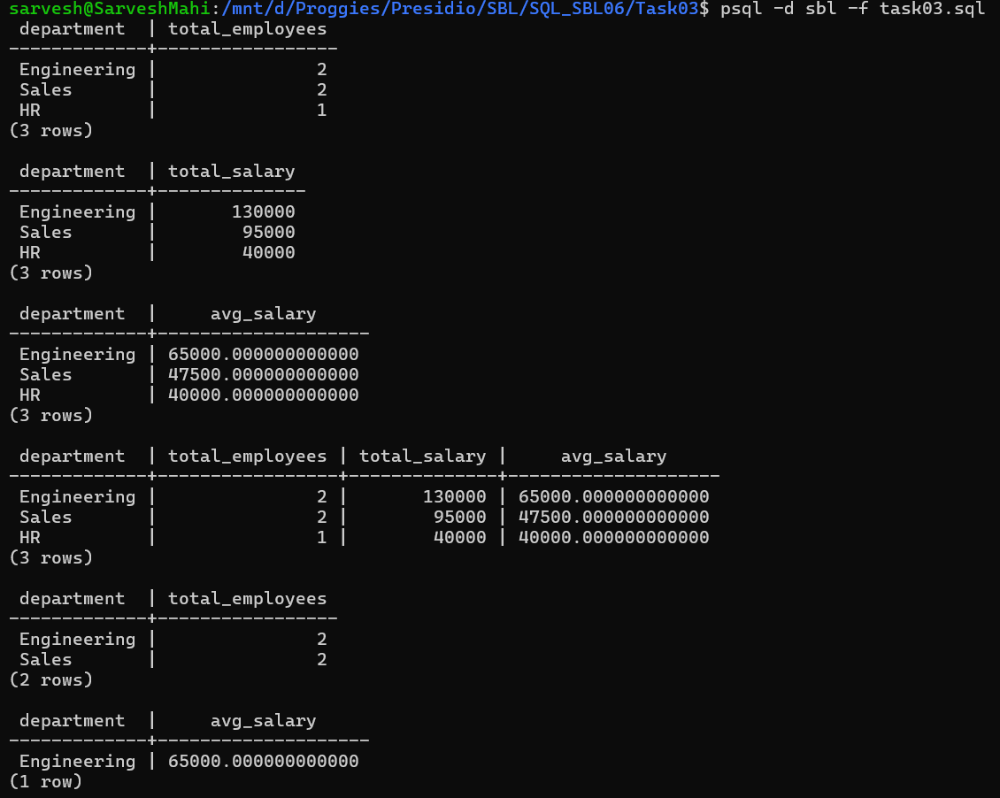

# 📘 SQL Task 3: Aggregation and Grouping

## 🎯 Objective

The goal of this task is to:

* Summarize data using aggregate functions
* Group records based on a specific column
* Filter grouped results using the `HAVING` clause

---

## 🛠️ Environment

* **Database:** PostgreSQL
* **Execution Method:** WSL (Linux terminal using `psql`)
* **Database Name:** `sbl`
* **Table Used:** `employees`

---

## 🔢 Step 1: Counting Records using COUNT()

### ✅ Query Used

```sql
SELECT department, COUNT(*) AS total_employees
FROM employees
GROUP BY department;
```

### 💡 Explanation

* Groups employees by department
* Counts number of employees in each department

---

## 💰 Step 2: Summing Values using SUM()

### ✅ Query Used

```sql
SELECT department, SUM(salary) AS total_salary
FROM employees
GROUP BY department;
```

### 💡 Explanation

* Calculates total salary for each department

---

## 📊 Step 3: Calculating Average using AVG()

### ✅ Query Used

```sql
SELECT department, AVG(salary) AS avg_salary
FROM employees
GROUP BY department;
```

### 💡 Explanation

* Computes average salary per department

---

## 🔍 Step 4: Multiple Aggregations

### ✅ Query Used

```sql
SELECT 
    department,
    COUNT(*) AS total_employees,
    SUM(salary) AS total_salary,
    AVG(salary) AS avg_salary
FROM employees
GROUP BY department;
```

### 💡 Explanation

* Combines multiple aggregate functions in a single query

---

## 🚫 Step 5: Filtering Groups using HAVING

### ✅ Query Used

```sql
SELECT department, COUNT(*) AS total_employees
FROM employees
GROUP BY department
HAVING COUNT(*) > 1;
```

### 💡 Explanation

* Filters grouped results
* Only departments with more than 1 employee are shown

---

## 💸 Step 6: HAVING with Aggregate Condition

### ✅ Query Used

```sql
SELECT department, AVG(salary) AS avg_salary
FROM employees
GROUP BY department
HAVING AVG(salary) > 50000;
```

### 💡 Explanation

* Filters departments where average salary is greater than 50000

---

## 📊 Output



---

## ✅ Conclusion

* Successfully used aggregate functions (`COUNT`, `SUM`, `AVG`)
* Grouped data using `GROUP BY`
* Applied filters on grouped data using `HAVING`
* Demonstrated how to summarize and analyze structured data

---

## 🚀 Key Learnings

* `GROUP BY` is used to organize data into categories
* Aggregate functions help summarize large datasets
* `HAVING` is used to filter grouped results (unlike `WHERE`)
* Combining multiple aggregates provides deeper insights

---
