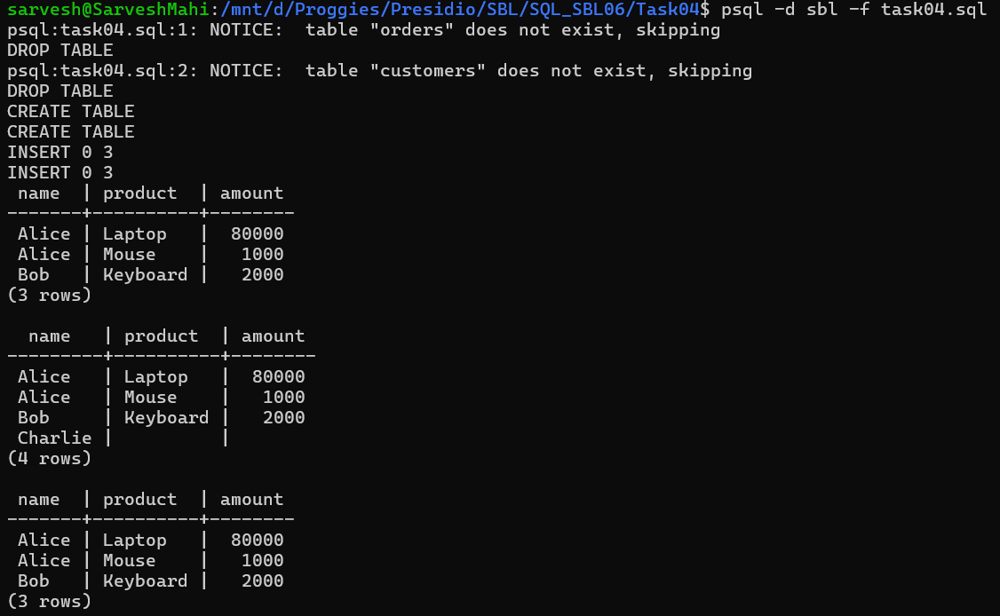

# 📘 SQL Task 4: Multi-Table JOINs

## 🎯 Objective

The goal of this task is to:

* Combine data from multiple tables
* Understand relationships using foreign keys
* Retrieve meaningful combined data using JOIN operations

---

## 🛠️ Environment

* **Database:** PostgreSQL
* **Execution Method:** WSL (Linux terminal using `psql`)
* **Database Name:** `sbl`
* **Tables Used:** `customers`, `orders`

---

## 🧱 Step 1: Creating Tables

### ✅ Customers Table

```sql
CREATE TABLE customers (
    id SERIAL PRIMARY KEY,
    name VARCHAR(100) NOT NULL,
    email VARCHAR(100) UNIQUE
);
```

### ✅ Orders Table

```sql
CREATE TABLE orders (
    id SERIAL PRIMARY KEY,
    customer_id INT,
    product VARCHAR(100),
    amount INT,
    FOREIGN KEY (customer_id) REFERENCES customers(id)
);
```

### 💡 Explanation

* `customers` stores customer details
* `orders` stores order information
* `customer_id` links orders to customers (foreign key relationship)

---

## 📥 Step 2: Inserting Data

### ✅ Insert into Customers

```sql
INSERT INTO customers (name, email) VALUES
('Alice', 'alice@example.com'),
('Bob', 'bob@example.com'),
('Charlie', 'charlie@example.com');
```

### ✅ Insert into Orders

```sql
INSERT INTO orders (customer_id, product, amount) VALUES
(1, 'Laptop', 80000),
(1, 'Mouse', 1000),
(2, 'Keyboard', 2000);
```

---

## 🔗 Step 3: INNER JOIN

### ✅ Query Used

```sql
SELECT 
    customers.name,
    orders.product,
    orders.amount
FROM customers
INNER JOIN orders
ON customers.id = orders.customer_id;
```

### 💡 Explanation

* Returns only records where there is a match in both tables
* Shows customers along with their orders

---

## 🔍 Step 4: LEFT JOIN

### ✅ Query Used

```sql
SELECT 
    customers.name,
    orders.product,
    orders.amount
FROM customers
LEFT JOIN orders
ON customers.id = orders.customer_id;
```

### 💡 Explanation

* Returns all customers, even if they have no orders
* Missing values appear as `NULL`

---

## 🎯 Step 5: RIGHT JOIN (Optional)

### ✅ Query Used

```sql
SELECT 
    customers.name,
    orders.product,
    orders.amount
FROM customers
RIGHT JOIN orders
ON customers.id = orders.customer_id;
```

### 💡 Explanation

* Returns all orders, even if customer details are missing

---

## 📊 Output



---

## ✅ Conclusion

* Successfully created related tables using foreign keys
* Combined data using `INNER JOIN` and `LEFT JOIN`
* Understood how JOINs handle matching and non-matching records

---

## 🚀 Key Learnings

* JOINs are essential for combining data across tables
* `INNER JOIN` returns only matching rows
* `LEFT JOIN` keeps all rows from the left table
* Foreign keys help maintain relationships between tables

---
