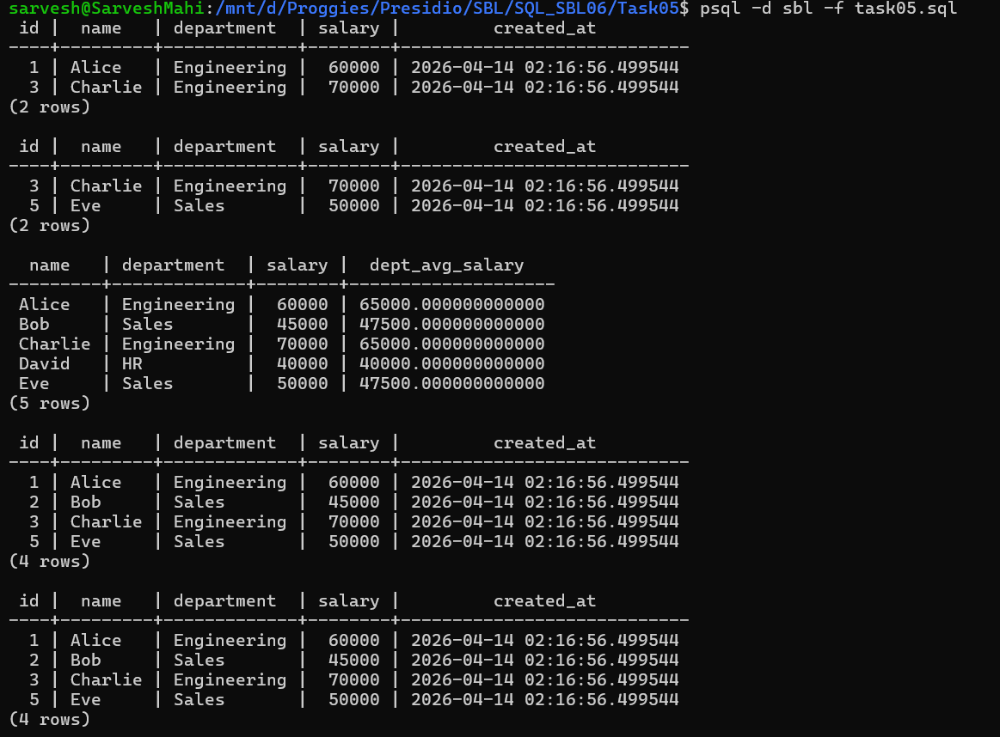

# 📘 SQL Task 5: Subqueries and Nested Queries

## 🎯 Objective

The goal of this task is to:

* Use subqueries to filter and compute values
* Understand correlated and non-correlated subqueries
* Generate dynamic results using nested queries

---

## 🛠️ Environment

* **Database:** PostgreSQL
* **Execution Method:** WSL (Linux terminal using `psql`)
* **Database Name:** `sbl`
* **Table Used:** `employees`

---

## 🔍 Step 1: Subquery in WHERE (Non-Correlated)

### ✅ Query Used

```sql
SELECT *
FROM employees
WHERE salary > (
    SELECT AVG(salary) FROM employees
);
```

### 💡 Explanation

* Calculates the overall average salary
* Returns employees earning above the average
* Subquery runs independently of the outer query

---

## 🧠 Step 2: Correlated Subquery

### ✅ Query Used

```sql
SELECT e1.*
FROM employees e1
WHERE salary > (
    SELECT AVG(e2.salary)
    FROM employees e2
    WHERE e2.department = e1.department
);
```

### 💡 Explanation

* Computes average salary **per department**
* Compares each employee with their department average
* Subquery depends on the outer query → *correlated*

---

## 📊 Step 3: Subquery in SELECT

### ✅ Query Used

```sql
SELECT 
    name,
    department,
    salary,
    (
        SELECT AVG(e2.salary)
        FROM employees e2
        WHERE e2.department = e1.department
    ) AS dept_avg_salary
FROM employees e1;
```

### 💡 Explanation

* Adds a computed column showing department average salary
* Demonstrates dynamic column generation

---

## 🔢 Step 4: Subquery with IN

### ✅ Query Used

```sql
SELECT *
FROM employees
WHERE department IN (
    SELECT department
    FROM employees
    GROUP BY department
    HAVING COUNT(*) > 1
);
```

### 💡 Explanation

* Finds departments with more than one employee
* Retrieves employees belonging to those departments

---

## 🚫 Step 5: Subquery with NOT IN

### ✅ Query Used

```sql
SELECT *
FROM employees
WHERE department NOT IN (
    SELECT department FROM employees WHERE department = 'HR'
);
```

### 💡 Explanation

* Excludes employees from the HR department

---

## 📊 Output



---

## ✅ Conclusion

* Successfully implemented subqueries in different clauses
* Understood correlated vs non-correlated subqueries
* Used subqueries to filter and compute dynamic results

---

## 🚀 Key Learnings

* Subqueries allow nested logic inside queries
* Correlated subqueries depend on outer query values
* Non-correlated subqueries run independently
* Subqueries can be used in `WHERE`, `SELECT`, and `IN` clauses

---
