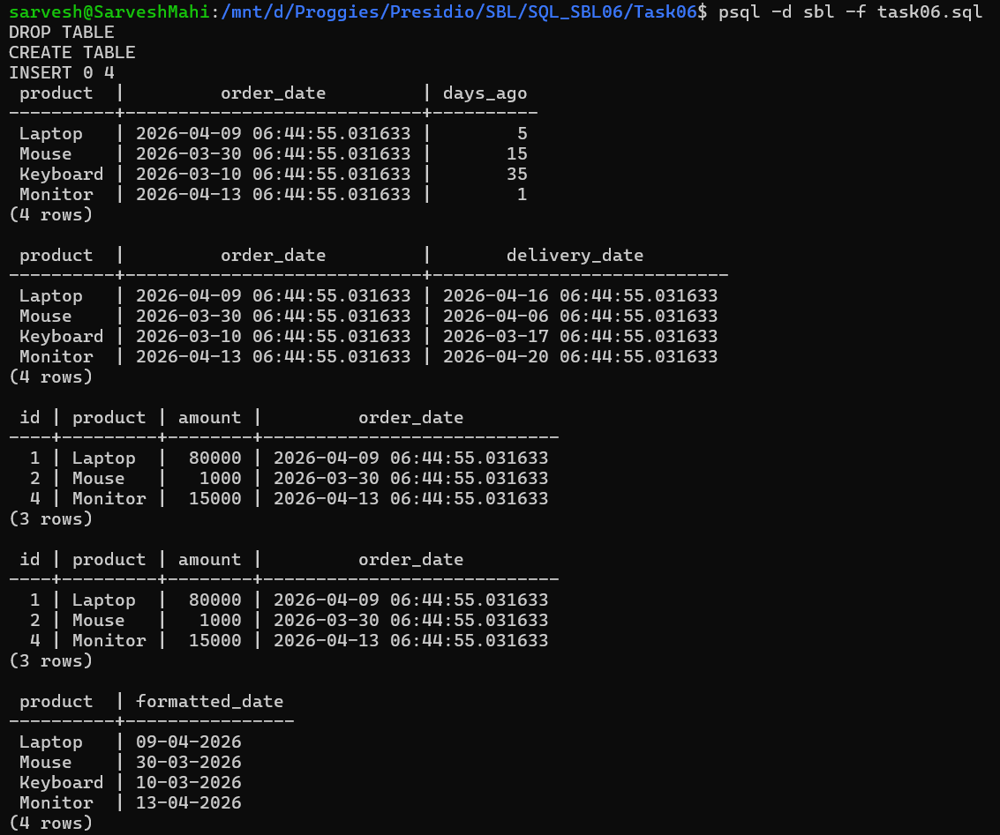
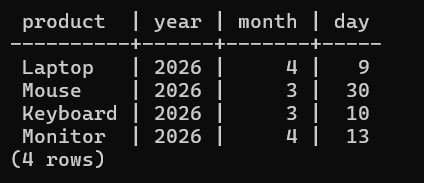

# 📘 SQL Task 6: Date and Time Functions

## 🎯 Objective

The goal of this task is to:

* Manipulate and query data based on date and time values
* Perform date calculations and filtering
* Format and extract specific parts of date values

---

## 🛠️ Environment

* **Database:** PostgreSQL
* **Execution Method:** WSL (Linux terminal using `psql`)
* **Database Name:** `sbl`
* **Table Used:** `orders`

---

## 🧱 Step 1: Creating Table

### ✅ Query Used

```sql
CREATE TABLE orders (
    id SERIAL PRIMARY KEY,
    product VARCHAR(100),
    amount INT,
    order_date TIMESTAMP DEFAULT CURRENT_TIMESTAMP
);
```

### 💡 Explanation

* Stores order details along with timestamp information
* `order_date` automatically captures current time if not provided

---

## 📥 Step 2: Inserting Data with Custom Dates

### ✅ Query Used

```sql
INSERT INTO orders (product, amount, order_date) VALUES
('Laptop', 80000, NOW() - INTERVAL '5 days'),
('Mouse', 1000, NOW() - INTERVAL '15 days'),
('Keyboard', 2000, NOW() - INTERVAL '35 days'),
('Monitor', 15000, NOW() - INTERVAL '1 day');
```

### 💡 Explanation

* Uses `INTERVAL` to insert past dates dynamically

---

## ⏱️ Step 3: Date Difference Calculation

### ✅ Query Used

```sql
SELECT 
    product,
    order_date,
    CURRENT_DATE - order_date::date AS days_ago
FROM orders;
```

### 💡 Explanation

* Calculates number of days since each order

---

## ➕ Step 4: Adding Time Interval

### ✅ Query Used

```sql
SELECT 
    product,
    order_date,
    order_date + INTERVAL '7 days' AS delivery_date
FROM orders;
```

### 💡 Explanation

* Adds 7 days to calculate estimated delivery date

---

## 🔍 Step 5: Filtering Recent Records

### ✅ Query Used

```sql
SELECT *
FROM orders
WHERE order_date >= NOW() - INTERVAL '30 days';
```

### 💡 Explanation

* Retrieves orders placed within the last 30 days

---

## 📅 Step 6: Filtering Using Date Range

### ✅ Query Used

```sql
SELECT *
FROM orders
WHERE order_date BETWEEN 
    NOW() - INTERVAL '30 days' AND NOW();
```

### 💡 Explanation

* Filters data within a specific time range

---

## 🎨 Step 7: Formatting Date

### ✅ Query Used

```sql
SELECT 
    product,
    TO_CHAR(order_date, 'DD-MM-YYYY') AS formatted_date
FROM orders;
```

### 💡 Explanation

* Converts timestamp into a readable date format

---

## 🧠 Step 8: Extracting Date Parts

### ✅ Query Used

```sql
SELECT 
    product,
    EXTRACT(YEAR FROM order_date) AS year,
    EXTRACT(MONTH FROM order_date) AS month,
    EXTRACT(DAY FROM order_date) AS day
FROM orders;
```

### 💡 Explanation

* Extracts year, month, and day from timestamp

---

## 📊 Output





---

## ✅ Conclusion

* Successfully performed date calculations using `INTERVAL`
* Filtered records based on time conditions
* Formatted and extracted date values for better readability
* Demonstrated real-world usage of date functions

---

## 🚀 Key Learnings

* PostgreSQL uses `INTERVAL` for date arithmetic
* Date filtering is essential for analytics and reporting
* `TO_CHAR` helps format dates for display
* `EXTRACT` is useful for breaking down date components

---
