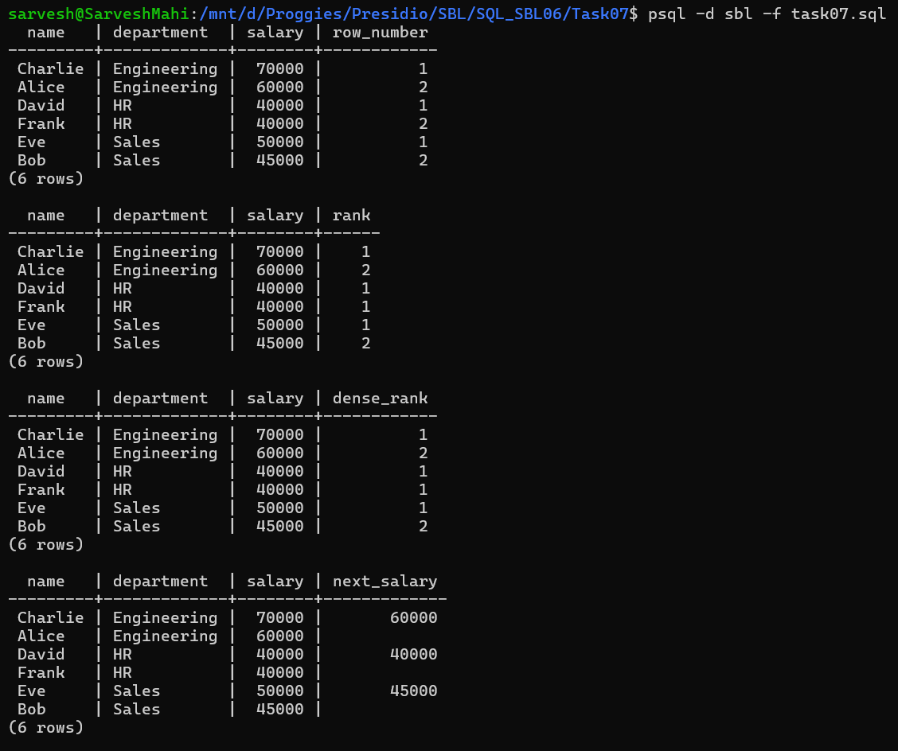
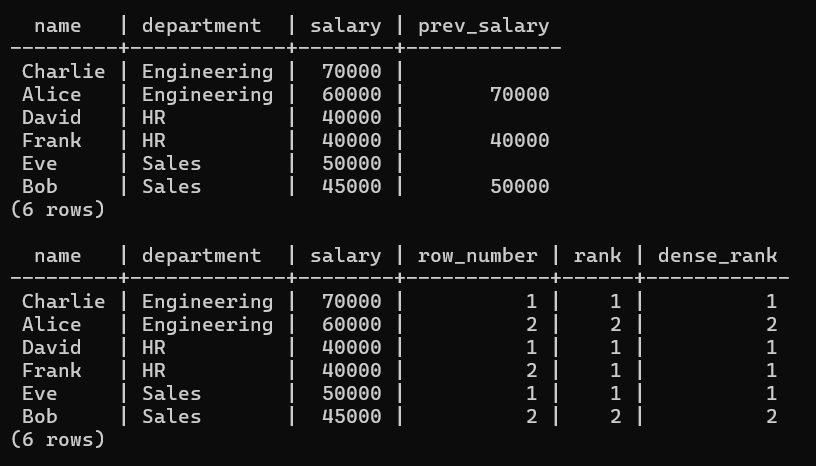

# 📘 SQL Task 7: Window Functions and Ranking

## 🎯 Objective

The goal of this task is to:

* Perform calculations across rows without reducing the result set
* Assign rankings within groups using window functions
* Access adjacent row values using advanced functions

---

## 🛠️ Environment

* **Database:** PostgreSQL
* **Execution Method:** WSL (Linux terminal using `psql`)
* **Database Name:** `sbl`
* **Table Used:** `employees`

---

## 🧱 Step 1: ROW_NUMBER()

### ✅ Query Used

```sql
SELECT 
    name,
    department,
    salary,
    ROW_NUMBER() OVER (
        PARTITION BY department 
        ORDER BY salary DESC
    ) AS row_number
FROM employees;
```

### 💡 Explanation

* Assigns a unique number to each employee within a department
* Ranking is based on salary (highest first)

---

## 🏆 Step 2: RANK()

### ✅ Query Used

```sql
SELECT 
    name,
    department,
    salary,
    RANK() OVER (
        PARTITION BY department 
        ORDER BY salary DESC
    ) AS rank
FROM employees;
```

### 💡 Explanation

* Assigns rank with gaps when there are ties
* Employees with the same salary share the same rank

---

## 🥇 Step 3: DENSE_RANK()

### ✅ Query Used

```sql
SELECT 
    name,
    department,
    salary,
    DENSE_RANK() OVER (
        PARTITION BY department 
        ORDER BY salary DESC
    ) AS dense_rank
FROM employees;
```

### 💡 Explanation

* Similar to `RANK()` but without gaps
* Provides continuous ranking

---

## 🔍 Step 4: LEAD()

### ✅ Query Used

```sql
SELECT 
    name,
    department,
    salary,
    LEAD(salary) OVER (
        PARTITION BY department 
        ORDER BY salary DESC
    ) AS next_salary
FROM employees;
```

### 💡 Explanation

* Retrieves the next row’s salary within the same department
* Useful for comparison and trend analysis

---

## 🔙 Step 5: LAG()

### ✅ Query Used

```sql
SELECT 
    name,
    department,
    salary,
    LAG(salary) OVER (
        PARTITION BY department 
        ORDER BY salary DESC
    ) AS prev_salary
FROM employees;
```

### 💡 Explanation

* Retrieves the previous row’s salary
* Useful for analyzing differences between rows

---

## 🎯 Step 6: Combined Window Functions

### ✅ Query Used

```sql
SELECT 
    name,
    department,
    salary,
    ROW_NUMBER() OVER (PARTITION BY department ORDER BY salary DESC) AS row_number,
    RANK() OVER (PARTITION BY department ORDER BY salary DESC) AS rank,
    DENSE_RANK() OVER (PARTITION BY department ORDER BY salary DESC) AS dense_rank
FROM employees;
```

### 💡 Explanation

* Demonstrates multiple window functions in a single query
* Useful for comprehensive ranking analysis

---

## 📊 Output





---

## ✅ Conclusion

* Successfully applied window functions to analyze data
* Ranked employees within departments using multiple methods
* Compared adjacent rows using `LEAD()` and `LAG()`
* Maintained row-level detail while performing advanced calculations

---

## 🚀 Key Learnings

* Window functions allow analysis without reducing rows
* `PARTITION BY` groups data logically
* `ORDER BY` defines ranking order
* Functions like `ROW_NUMBER`, `RANK`, `DENSE_RANK`, `LEAD`, and `LAG` are essential for advanced SQL

---