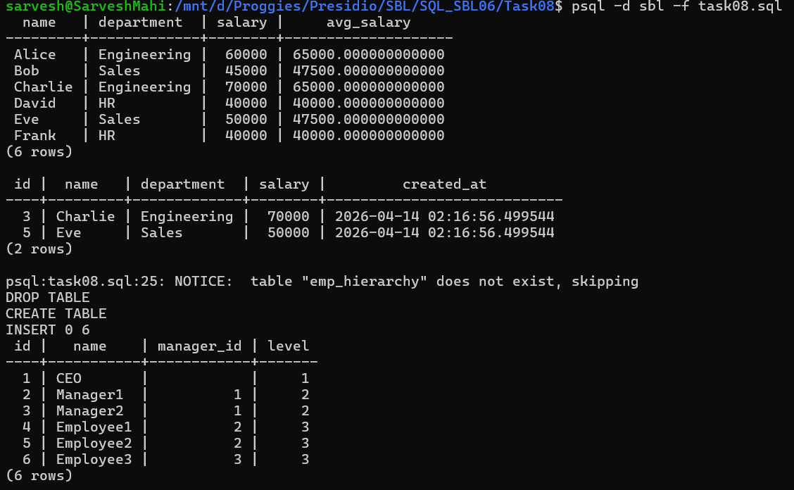

# 📘 SQL Task 8: CTEs and Recursive Queries

## 🎯 Objective

The goal of this task is to:

* Simplify complex queries using Common Table Expressions (CTEs)
* Improve query readability and structure
* Work with hierarchical data using recursive queries

---

## 🛠️ Environment

* **Database:** PostgreSQL
* **Execution Method:** WSL (Linux terminal using `psql`)
* **Database Name:** `sbl`
* **Tables Used:** `employees`, `emp_hierarchy`

---

## 🧱 Step 1: Non-Recursive CTE

### ✅ Query Used

```sql
WITH dept_avg AS (
    SELECT department, AVG(salary) AS avg_salary
    FROM employees
    GROUP BY department
)
SELECT e.name, e.department, e.salary, d.avg_salary
FROM employees e
JOIN dept_avg d
ON e.department = d.department;
```

### 💡 Explanation

* Creates a temporary result (`dept_avg`)
* Stores average salary per department
* Joins it with employees to display additional computed data

---

## 🔍 Step 2: Filtering using CTE

### ✅ Query Used

```sql
WITH dept_avg AS (
    SELECT department, AVG(salary) AS avg_salary
    FROM employees
    GROUP BY department
)
SELECT e.*
FROM employees e
JOIN dept_avg d
ON e.department = d.department
WHERE e.salary > d.avg_salary;
```

### 💡 Explanation

* Filters employees earning above their department average
* Demonstrates how CTE simplifies complex logic

---

## 🌳 Step 3: Creating Hierarchical Table

### ✅ Query Used

```sql
CREATE TABLE emp_hierarchy (
    id SERIAL PRIMARY KEY,
    name VARCHAR(100),
    manager_id INT
);
```

---

## 📥 Step 4: Inserting Hierarchical Data

### ✅ Query Used

```sql
INSERT INTO emp_hierarchy (name, manager_id) VALUES
('CEO', NULL),
('Manager1', 1),
('Manager2', 1),
('Employee1', 2),
('Employee2', 2),
('Employee3', 3);
```

---

## 🔁 Step 5: Recursive CTE

### ✅ Query Used

```sql
WITH RECURSIVE org_chart AS (
    SELECT id, name, manager_id, 1 AS level
    FROM emp_hierarchy
    WHERE manager_id IS NULL

    UNION ALL

    SELECT e.id, e.name, e.manager_id, o.level + 1
    FROM emp_hierarchy e
    JOIN org_chart o
    ON e.manager_id = o.id
)
SELECT * FROM org_chart;
```

### 💡 Explanation

* Base case selects top-level employee (CEO)
* Recursive part finds subordinates
* Builds a hierarchical structure with levels

---

## 📊 Output



---

## ✅ Conclusion

* Successfully used CTEs to simplify complex queries
* Implemented filtering using intermediate results
* Built hierarchical data traversal using recursive CTE
* Demonstrated real-world usage of recursive queries

---

## 🚀 Key Learnings

* CTEs improve readability and maintainability
* Recursive CTEs are used for hierarchical data
* `WITH RECURSIVE` enables repeated execution
* Useful in real-world scenarios like org charts and trees

---
