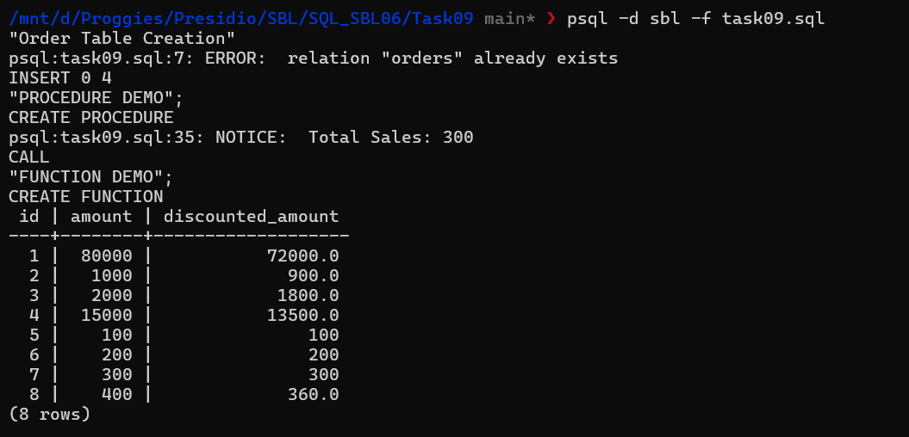

# 📘 SQL Task 09 – Stored Procedures and User-Defined Functions

## 🎯 Objective

The objective of this task is to encapsulate business logic using **stored procedures** and **user-defined functions** in PostgreSQL. This includes:

* Creating a stored procedure to process and display aggregated data
* Writing a user-defined function for reusable calculations
* Testing both using sample data

---

## 🛠️ Steps Performed

---

### 1. Create Sample Table

A table `orders` was created to store order details:

```sql
CREATE TABLE orders (
    id SERIAL PRIMARY KEY,
    order_date DATE,
    amount NUMERIC
);
```

---

### 2. Insert Sample Data

```sql
INSERT INTO orders (order_date, amount) VALUES
('2026-01-01', 100),
('2026-01-05', 200),
('2026-02-01', 300),
('2026-02-10', 400);
```

---

## 🔁 Part 1: Stored Procedure

### 📌 Requirement

Calculate total sales within a given date range.

---

### 🔧 Create Procedure

```sql
CREATE OR REPLACE PROCEDURE get_total_sales(
    start_date DATE,
    end_date DATE
)
LANGUAGE plpgsql
AS $$
DECLARE
    total NUMERIC;
BEGIN
    SELECT SUM(amount)
    INTO total
    FROM orders
    WHERE order_date BETWEEN start_date AND end_date;

    RAISE NOTICE 'Total Sales: %', total;
END;
$$;
```

---

### ▶️ Execute Procedure

```sql
CALL get_total_sales('2026-01-01', '2026-01-31');
```

---

### ✅ Output

```text
NOTICE: Total Sales: 300
```

---

## 🧮 Part 2: User-Defined Function (Scalar)

### 📌 Requirement

Calculate discounted amount based on input value.

---

### 🔧 Create Function

```sql
CREATE OR REPLACE FUNCTION calculate_discount(amount NUMERIC)
RETURNS NUMERIC
LANGUAGE plpgsql
AS $$
BEGIN
    IF amount > 300 THEN
        RETURN amount * 0.9;
    ELSE
        RETURN amount;
    END IF;
END;
$$;
```

---

### ▶️ Execute Function

```sql
SELECT id, amount, calculate_discount(amount) AS discounted_amount
FROM orders;
```

---

### ✅ Output

```text
id | amount | discounted_amount
--------------------------------
1  | 100    | 100
2  | 200    | 200
3  | 300    | 300
4  | 400    | 360
```

---

## 📊 Output



---

## 🔄 Part 3: Table-Valued Function

### 📌 Requirement

Return orders within a given date range.

---

### 🔧 Create Function

```sql
CREATE OR REPLACE FUNCTION get_orders_by_date(
    start_date DATE,
    end_date DATE
)
RETURNS TABLE(id INT, order_date DATE, amount NUMERIC)
LANGUAGE plpgsql
AS $$
BEGIN
    RETURN QUERY
    SELECT id, order_date, amount
    FROM orders
    WHERE order_date BETWEEN start_date AND end_date;
END;
$$;
```

---

### ▶️ Execute Function

```sql
SELECT * FROM get_orders_by_date('2026-01-01', '2026-01-31');
```

---

## 🧠 Key Learnings

* Stored procedures are used for executing business logic and workflows
* Functions return values and can be used inside queries
* Functions promote code reusability
* Procedures are invoked using `CALL`, functions using `SELECT`

---

## ⚖️ Procedure vs Function

| Feature         | Procedure | Function     |
| --------------- | --------- | ------------ |
| Invocation      | CALL      | SELECT       |
| Returns value   | ❌ No      | ✅ Yes        |
| Used in queries | ❌         | ✅            |
| Use case        | workflows | calculations |

---

## ⚠️ Important Notes

* `SUM()` may return NULL if no rows match → handle if needed
* Functions should be used when output is required in queries
* Procedures are better for complex operations and transactions

---

## 🚀 Conclusion

This task demonstrates how to encapsulate business logic using stored procedures and user-defined functions in PostgreSQL. These concepts are essential for building scalable, maintainable, and reusable database logic in real-world applications.

---
